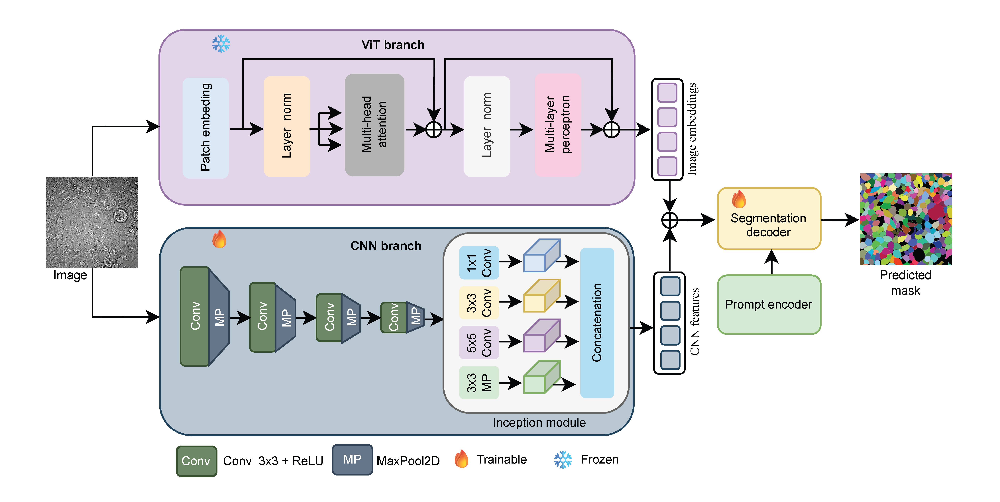
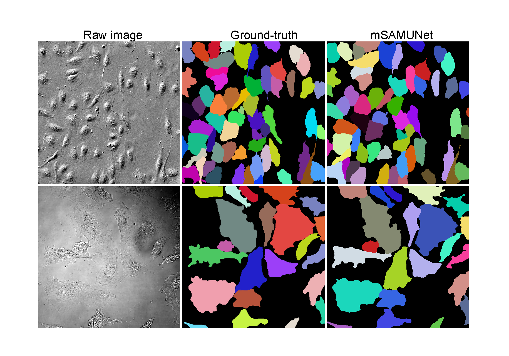

## mSAMUNet: Cell Segmentation in Microscopy Images Using a SAM-Based U-Net Architecture and a Novel Dataset

<p align="center">
  
  <br>
  <em>Figure: Architecture of the proposed mSAMUNet network.</em>
</p>


This repository contains the Python implementation of mSAMUNet. mSAMUNet extends the [micro-sam](https://github.com/computational-cell-analytics/micro-sam) framework by incorporating a parallel Inception-based CNN encoder alongside the frozen SAM ViT encoder, combining local boundary feature extraction with global contextual modelling for robust cell instance segmentation in microscopy images.

## Installation

mSAMUNet builds on top of the [micro-sam](https://computational-cell-analytics.github.io/micro-sam/micro_sam.html) framework. To use the proposed architecture, the base framework must be installed and the network file replaced.

---

### 1. Clone the repository

```bash
git clone https://github.com/msalam0104/mSAMUNet.git
cd mSAMUNet
```

### 2. Install the framework
Please follow the **[official micro-sam installation guide](https://computational-cell-analytics.github.io/micro-sam/micro_sam.html)** to set up the base framework manually. 

**Optional: Recreate our exact environment**  
Alternatively, you can recreate the exact environment used in our experiments using the provided Conda or pip files. This will automatically install all required packages, including `micro-sam` and `torch-em`.

*For Conda users:*
```bash
conda env create -f environment.yml
conda activate msamunet
```

*For pip users:*
```bash
pip install -r requirements.txt
```

### 3. Integrate the mSAMUNet Architecture
Once the framework is installed, locate the `torch-em` package inside your Python environment and replace its default `unetr.py` file with our custom version (`msamunet/models/unetr.py`).

```bash
# Example command to replace the file in your environment
cp msamunet/models/unetr.py /path/to/your/env/lib/python3.10/site-packages/torch_em/model/unetr.py
```
*(Note: The exact destination path will vary depending on your virtual environment name and Python version).*

Once this file is replaced, any standard `micro-sam` training or inference scripts will automatically utilize the mSAMUNet architecture!

## Training and Evaluation

We utilized the training and evaluation framework provided by micro-sam for all experiments in this study.

## Dataset

The mCellSeg dataset consists of 200 expert-annotated microscopy images (HEK-293T and HUVECs) captured via phase-contrast and fluorescence microscopy.

<p align="center">
  
  <br>
  <em>Figure: Representative samples from the mCellSeg dataset. From left to right: raw microscopy image, ground truth annotation, and mSAMUNet segmentation result.</em>
</p>

The dataset introduced in this work is publicly available on:

- **Zenodo:** [https://doi.org/10.5281/zenodo.20174259](https://doi.org/10.5281/zenodo.20174259)
- **Kaggle:** [mCellSeg: Microscopy Cell Segmentation Dataset](https://www.kaggle.com/datasets/tukunzil/mcellseg-microscopy-cell-segmentation-dataset)

## Citation

If you use **mSAMUNet** or **mCellSeg** in your research, please cite our paper:

```bibtex
@article{alam2026mcellseg,
  title={Cell segmentation in microscopy images using a SAM-based U-Net architecture and a novel dataset},
  author={Alam, Md. Shariful and Jackson, Miriam and Lord, Megan and Meijering, Erik},
  journal={Computer Methods and Programs in Biomedicine},
  year={2026},
  note={Under review}
}
```
If you use the mSAMUNet architecture, please also cite the related works:

<a href="https://www.nature.com/articles/s41592-024-02580-4">Segment Anything for Microscopy</a>


<a href="https://arxiv.org/abs/2304.02643">Segment Anything</a>


